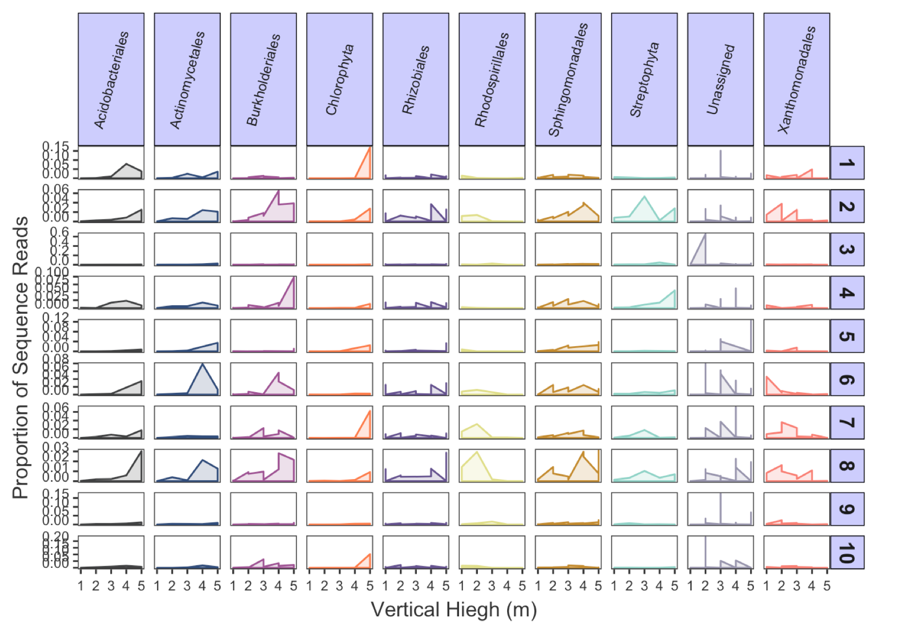

#  Abundance Vizualiation of Metabarcode Sequence Data

## Author

Georgina L. Brennan
(ORCID: 0000-0003-2045-757X)

## Summary

This R markdown document will help you get to grips with visualising and analysing metabarcoding sequence data - from importing data files, sorting and filtering data, data visualisations and summary statistics. Expected outputs include:

1.    A abundance graph to visualise taxa abundance across different environmental gradients (here we use vertical tree height).
2.    Data manipulation tools for data analysis, plotting, exporting etc.
3.    Summary statistics to enable decision making for appropriate statistical models.

**Github Repository:** <https://github.com/G-Brennan/Metabarcoding_group_UCDavis>

**Open Notebook (RStudio):** 

**Open Notebook (Binder):** 
