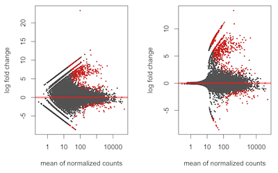

# Differential Expression Analysis with DESeq

## Authors

Michael D. Lee, Shengwei Hou

## Summary

This RStudio binder contains example code for generating
hierarchical clustering and ordination exploratory
visualizations and some example code for running a
differential expression analysis in
[DESeq2](https://bioconductor.org/packages/release/bioc/html/DESeq2.html).

## Links

**Github Repository:** <https://github.com/AstrobioMike/speeding-up-science-binder/>

**Open Notebook (Binder):** 

**Open Notebook (HTML):** 

* [Exploratory visualizations](https://github.com/AstrobioMike/speeding-up-science-binder/blob/master/hclust-ord-plot.html)
* [DESeq2](https://github.com/AstrobioMike/speeding-up-science-binder/blob/master/deseq.html)

