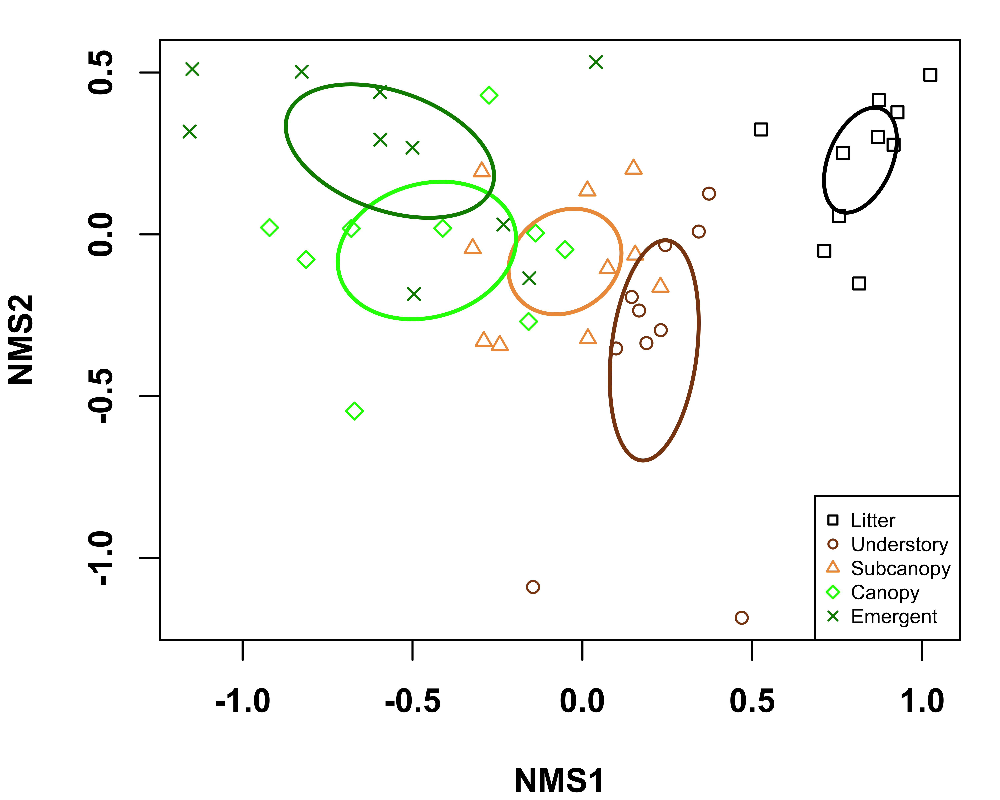

# Initial Visualization for Metabarcoding Data

## Authors

Jane Lucas 

## Summary

This Juptyer notebook contains a workflow to visualizte
non-metric multidimensional scaling (NMDS) of 
metabarcoding samples.

## Links

**Github Repository:** <https://github.com/janelucas/NMDS>

**Open Notebook (Binder):** 

**Open Notebook (HTML):** (TBA)

