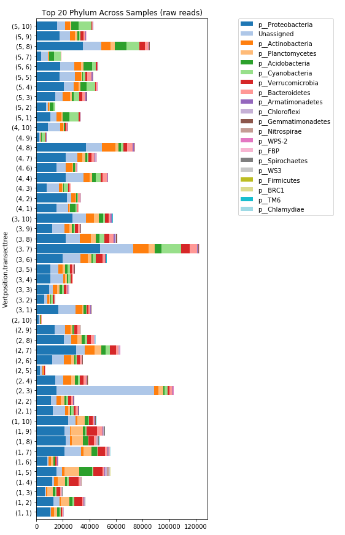

# Interactive First-Look Metabarcoding

## Authors

Katie Pitz

## Summary

This Jupyter notebook contains a workflow to interactively
visualize the taxa makeup of samples.

## Links

**Github Repository:** <https://github.com/kpitz/UCDavis_Hackathon>

**Open Notebook (Binder):** 

**Open Notebook (HTML):** (TBA)

