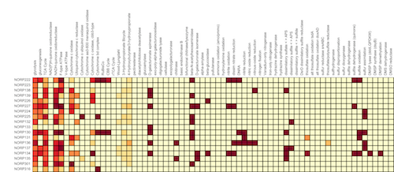

# KEGG Decoder Heatmap

## Authors

Benjamin Tully (USC), Taylor Reiter (UC Davis), Roth Conrad (Georgia Tech), Jay Osvatic (Univeristy of Vienna), Luiz Irber (UC Davis)

## Summary

This notebook contains a workflow for parsing through KEGG-Koala outputs 
(including blastKOALA, ghostKOALA, KOFAMSCAN) to determine the completeness 
of various metabolic pathways.

## Links

**Github Repository:**

* [KEGG Decoder Binder Repository](https://github.com/rotheconrad/KEGGDecoder-binder) 
* [KEGG Decoder Repository](https://github.com/bjtully/BioData/tree/master/KEGGDecoder)

**Open Notebook (Binder):** 

**Open Notebook (HTML):** (TBA)

