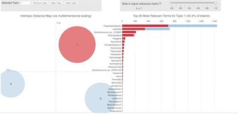

# LDA (Latent Dirichlet Analysis) Analysis of Communities

## Authors

Anand Roopsind, Stephanie F. Hudon and Bianca R.P. Brown

## Summary

Latent Dirichlet Allocation (LDA) is used to help determine relationships and
structure in microbial communities. LDA is a Bayesian based method which infers
these relationships by grouping sequence data into communities and determining
the likelihood of these communities comprising a given sample. The approach can
easily be applied to any metagenomic or metatranscriptomic data set which has
resulted in a count table of taxonomy or gene functions.

## Links

**Github Repository:** <https://github.com/Biancabrown/LDA_binder_2>

**Open Notebook (Binder):** 

