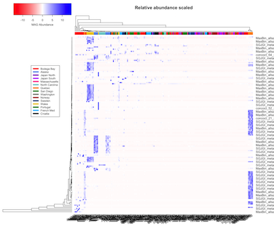

# MAG Representation

## Authors

[Marian](https://orcid.org/0000-0002-2866-4496), 
[Guillaume](https://orcid.org/0000-0002-8746-2632), 
[Laetitia Wilkins](https://orcid.org/0000-0003-3632-2063), 
Charles Reid

## Summary

This notebook contains a workflow for creating a heatmap visualization
of reads against bins or genomes created.

This repository uses only an RMarkdown script as input,
see [this tutorial](https://kbroman.org/blog/2019/02/18/omg_binder/)
for details.

## Links

**Github Repository:** <https://github.com/megaptera-helvetiae/MAGrepresentation-Binder>

**Open Notebook (Binder):** 

* RStudio version: 
* Jupyter notebook version: 

**Open Notebook (HTML):** (TBA)

