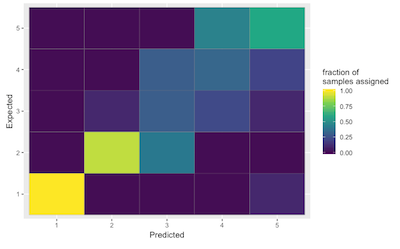

#  Random Forest Classifier of Metabarcode Sequence Data

## Author

Devon O'Rourke

## Summary

This R markdown document uses Random Forest (RF) classification to identify
ASVs that help discriminate amongst a metadata group. Expected outputs include:

1. A confusion matrix heatmap that  visualizes the precision of the model
2. A list of ASVs important to the RF model
3. A plot visualizing the taxa information associated with these relevant ASVs

**Github Repository:** <https://github.com/devonorourke/sus19mb>

**Open Notebook (Binder):** 

