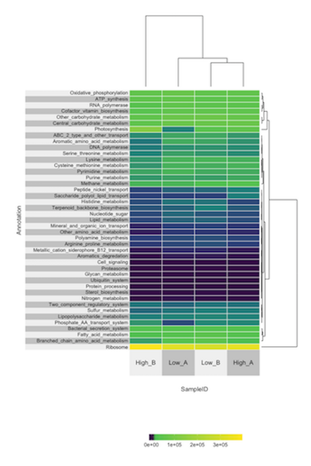

# Taxa and Function Summary

## Authors

[Zhengyao "Zeya" Xue](https://orcid.org/0000-0002-4930-8212)

## Summary

This notebook contains a workflow for visualizing KEGG function and taxa information.

The data files and R scripts can be found in this [GitHub repo](https://github.com/zeyaxue/speeding-up-science-binder).

## Links

**Github Repository:** <https://github.com/zeyaxue/speeding-up-science-binder>

**Open Notebook (Binder):** 

**Open Notebook (HTML):** [HTML version](taxa-and-function-summary-notebook.html)

